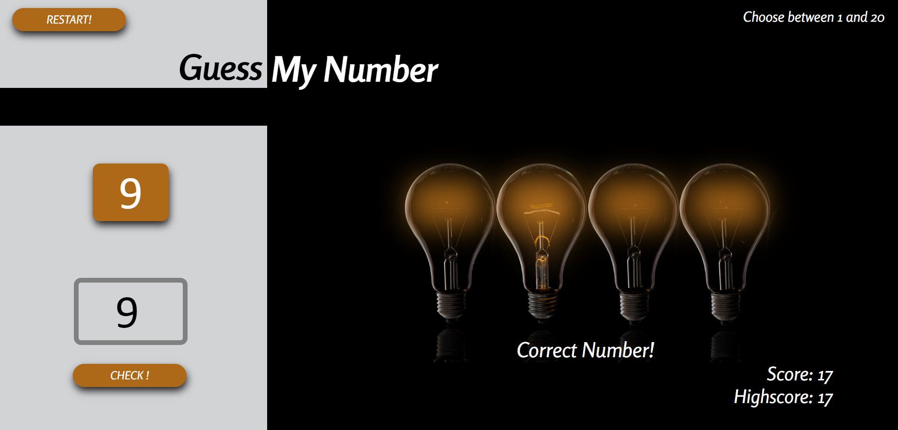

# Guess My Number Game

## Features

**Random Number Generation:** The game generates a random number for you to guess.

**User Feedback:** You receive hints whether your guess is too high or too low.

**Score Tracking:** Keep track of the number of attempts it took to guess the number correctly.

## How to Play

1. Enter your guess in the provided input field.

2. Click the "Check!" button.

3. The game will tell you if your guess is too high or too low

   (You will also notice different lighting 😉).

4. Keep guessing until you find the correct number.

## Technologies Used

- HTML
- CSS
- JavaScript

👉 [Getting Started](https://milanilic-w28.github.io/guess-my-number-game/)

## Screenshot

